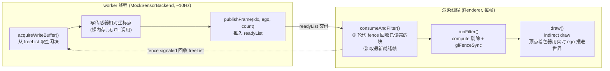
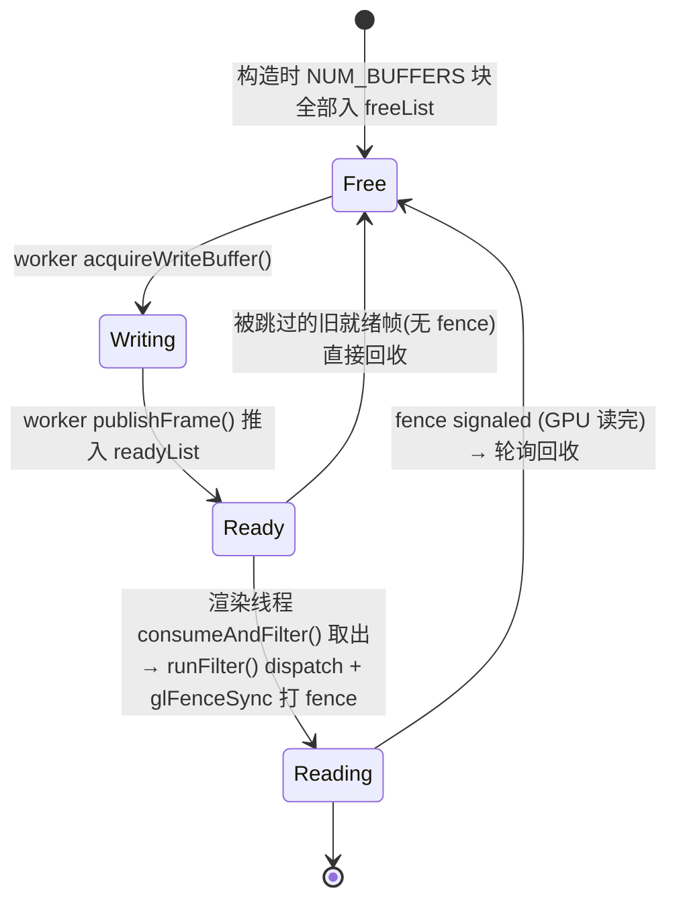

# 点云仿真渲染：架构与优化设计文档

> 本文档记录本项目（自动驾驶点云实时仿真/可视化工具）的渲染架构、
> 一轮性能优化的全过程，以及核心的 **「手搓 三缓冲 + FENCE」** 生产者/消费者设计。

---

## 目录

1. [项目概述](#1-项目概述)
2. [渲染架构总览](#2-渲染架构总览)
   - [2.1 Compute 剔除的 LOD 距离分带](#21-compute-剔除的-lod-距离分带shadersfiltercomp)
3. [优化历程（按实施顺序）](#3-优化历程按实施顺序)
4. [核心设计：手搓 三缓冲 + FENCE](#4-核心设计手搓-三缓冲--fence)
5. [性能数据与瓶颈分析](#5-性能数据与瓶颈分析)
6. [未来方向](#6-未来方向)

---

## 1. 项目概述

一个 C++ / OpenGL 4.3 的自动驾驶场景实时渲染器，模拟传感器（激光雷达点云）+
障碍物 + 车道线 + 自车的可视化。

**技术栈**：C++17 / OpenGL 4.3 Core / GLFW / GLAD / Dear ImGui / GLM / TBB（并行）。

**关键模块**：

| 模块 | 文件 | 职责 |
|---|---|---|
| `Renderer` | `src/renderer/Renderer.cpp` | 主循环、相机、各图层编排、性能探针 |
| `PointCloudLayer` | `src/renderer/PointCloudLayer.cpp` | 点云：三缓冲输入 + compute 剔除 + indirect draw |
| `MockSensorBackend` | `include/renderer/MockSensorBackend.hpp` | 后台 worker 线程，~10Hz 生成点云 |
| `MockFrameGenerator` | `src/data/MockFrameGenerator.cpp` | 每帧场景数据（自车/障碍物/车道线） |
| `ObstacleLayer` / `ObstacleEdgeLayer` | `include/renderer/` | 障碍物实例化渲染（填充 + 边框） |
| `BeltBatch` | `include/renderer/BeltBatch.hpp` | 车道线条带 |

---

## 2. 渲染架构总览

点云走的是一条 **GPU-driven** 管线，核心思想是「数据进 GPU 后，CPU 尽量不再参与」：



> 三缓冲让「worker 正在写的块」与「GPU 正在读的块」永不重叠；fence 标记「GPU 真读完了哪块」，
> 读完才允许 worker 重写。**所有 GL 调用只在渲染线程**，worker 仅写裸内存 + 操作队列。

四项关键 GPU 技术：

1. **Persistent Mapped Buffer**：`glBufferStorage` + `MAP_PERSISTENT_BIT | COHERENT_BIT`，
   worker 直接往映射内存写，免去每帧 map/unmap。
2. **Compute Shader 剔除**（`shaders/filter.comp`）：在 GPU 上按距离做 LOD 抽稀，
   组内 `atomicAdd` 紧凑写出。
3. **Indirect Draw**：compute 直接把保留点数写进 indirect buffer 的 `vertexCount`，
   `glDrawArraysIndirect` 读取——**全程无 CPU 回读**，不产生管线 stall。
4. **三缓冲 + Fence**：解决「worker 写 / GPU 读」的数据竞争（详见第 4 节）。

### 2.1 Compute 剔除的 LOD 距离分带（`shaders/filter.comp`）

剔除不是简单的「距离阈值内全留」，而是**越近越密、越远越稀**的距离分带抽稀——
近处保留全部细节，远处大幅降采样以省下绘制成本。核心条件（点到传感器原点的距离 `d`）：

| 距离区间 | 保留策略 | 等效密度 |
|---|---|---|
| `d < 3.5m` | 全部保留 | 1 / 1 |
| `d < 20m` | `idx % 3 == 0` | 1 / 3 |
| `d < 38.5m` | `idx % 15 == 0` | 1 / 15 |
| `d < 49.5m` | `idx % 45 == 0` | 1 / 45 |
| `d < 66m` | `idx % 170 == 0` | 1 / 170 |
| `d < 96m` | `idx % 300 == 0` | 1 / 300 |
| `d < 123m` | `idx % 700 == 0` | 1 / 700 |
| `d < 150m` | `idx % 1000 == 0` | 1 / 1000 |
| `d ≥ 150m` | 丢弃 | 0 |

**实现要点**（`filter.comp`）：
- `local_size_x = 256`，每个工作组先用 `shared` 计数器做**组内 `atomicAdd`** 求组内偏移；
- 再由组内 0 号线程对 indirect buffer 的 `vertexCount` 做**一次** `atomicAdd` 申请全局写入区间，
  大幅减少全局原子争用；
- 最后把保留点紧凑写入 `outputSSBO`。

> ⚠️ **注意**：这是基于点**索引**（`idx % N`）的抽稀，属于 mock 调好的可视化 LOD 策略。
> 喂真实数据时，抽稀质量取决于点的索引顺序；若真实点云索引无空间局部性，
> 可改为基于空间（如体素栅格）的降采样。

---

## 3. 优化历程（按实施顺序）

> 贯穿全程的原则：**先测量，再优化。** 切忌凭直觉拍脑袋——本项目最初猜测瓶颈是
> compute 剔除，实测后发现 compute ≈ 0ms，真正的大头是 draw。

### 3.0 障碍物链路去浪费（CPU 侧）

| 改动 | 位置 | 收益 |
|---|---|---|
| 删除 `Polygon.vertices` 死代码（4 角点全程无人读） | `MockFrameGenerator::vehicleToPolygon` | 每帧省 200 次 vector 堆分配 |
| `frame.polygons.reserve()` | `MockFrameGenerator::createFrame` | 消除 vector 扩容 |
| 填充层/边框层 **共用一份实例数据**，model 矩阵只算一次 | `Renderer::buildObstacleInstances` + 两个 `uploadInstances` | 矩阵计算 400→200 次/帧；alpha 改由 `obstacle.frag` 的 `uAlpha` uniform 控制 |

### 3.1 第 0 步：装性能探针（测量先行）

- GPU 计时：`GL_TIME_ELAPSED` query 分别包住 compute dispatch 和 indirect draw
  （`PointCloudLayer::runFilter` / `draw`）。
- 实际绘制点数 / 输入点数：`readDrawnCount()` / `getLastInputCount()`。
- 输出到标题栏 + 控制台：`FPS / Filter ms / FilterRuns/s / Draw ms / In / Pts`。

### 3.2 第 1 步（b）：按需剔除

把 `render()` 拆成 `runFilter()`（仅新数据时跑剔除）+ `draw()`（每帧画）。
点云数据是 ~10Hz 的，过去却每帧（数十~两百 Hz）重剔同一份结果——纯浪费。
→ `FilterRuns/s` 从 ≈FPS 降到 ~10，软渲下 **FPS 20 → 29**。

### 3.3 第 2 步（a）：三缓冲 + Fence + 变长点数

- **三缓冲 + Fence**：修掉「worker 写 / GPU 读同一块裸 buffer」的数据竞争（详见第 4 节）。
- **变长点数②**：worker 每帧发布实际点数，`runFilter` 按它设 `uTotalPoints`，
  不再固定满值扫缓冲尾部残留——真实激光雷达每帧点数本就可变。

### 3.4 顿挫修复：点云改用 ego 相对坐标

**问题**：点坐标里烘进了「生成那一刻的（10Hz、滞后的）ego」，相机却每帧跟着实时
ego 平滑移动 → 整团点云每秒 lurch（猛拽）~10 次。

**修复**（与真实传感器可视化一致的 ego 系模型）：
- worker 生成 **传感器相对坐标**（不烘 ego）；
- 剔除按 **距传感器原点** 的距离（LiDAR 量程本就相对自身，`uEgoPos = 0`）；
- 顶点着色器 `point_cloud.vert` 每帧用实时 ego（`uEgoWorld`）把点摆进世界
  → 点云平滑跟车，只有图案按 10Hz 刷新。

---

## 4. 核心设计：手搓 三缓冲 + FENCE

> 在代码里搜 `手搓` 或 `★` 可直接跳到全部相关位置。
> 全部逻辑集中在 `PointCloudLayer`，worker 端只是调用方。

### 4.1 要解决的问题

worker 线程持续往输入 SSBO 写点，GPU 的 compute 同时在读它。若共用**一块**裸 buffer 且
无同步：

- GPU 可能读到「一半旧帧、一半新帧」的撕裂数据 → 真实（有结构的）数据下偶发错帧；
- worker 可能在 GPU 还没读完时就覆写。

这是「能跑」与「可靠」的分水岭。

### 4.2 设计要点

1. **三缓冲**：保证「worker 正在写的块」与「GPU 正在读的块」永远不是同一块。
2. **Fence**：`glFenceSync(GL_SYNC_GPU_COMMANDS_COMPLETE)` 精确标记「GPU 真读完了某块」，
   读完才允许该块被 worker 重写。
3. **所有 GL 调用只在渲染线程**：worker 只写裸内存 + 操作队列，因此 **worker 不需要 GL 上下文**。
4. **两个队列 + 一把锁**：`freeList`（可写的空闲块）、`readyList`（已写好待消费的帧），
   `poolMtx` 保护。

### 4.3 数据结构（`include/renderer/PointCloudLayer.hpp`，横幅「之一」）

```cpp
static const int NUM_BUFFERS = 3;            // 三缓冲
GLuint inputSSBO[NUM_BUFFERS];               // 三块 persistent-mapped 输入缓冲
Point* mappedPtr[NUM_BUFFERS];               // 各自的 CPU 映射指针
GLsync fences[NUM_BUFFERS];                  // 守护各块的 GPU 读取完成

std::mutex poolMtx;                          // 保护下面两个队列
std::vector<int> freeList;                   // 可写的空闲块索引
struct ReadyFrame { int index; glm::vec3 ego; uint32_t count; };
std::deque<ReadyFrame> readyList;            // worker 已写好、待消费的帧
```

### 4.4 缓冲生命周期（状态流转）

任意一块缓冲在四种状态间轮转：



- 被 `consumeAndFilter` **跳过的旧就绪帧**（从未被 GPU 读、无 fence）直接还回 `freeList`。
- worker 取不到空闲块时**丢弃本帧**（宁可丢帧也不撕裂）。
- 关键：`runFilter` 里 compute 已把保留点**复制进 `outputSSBO`**，所以一旦 fence signaled，
  输入块即可回收——即使后续多帧还在 `draw()` 显示 `outputSSBO`，也互不影响。

### 4.5 代码分布速查

| 部分 | 位置 | 标记 |
|---|---|---|
| ① 数据结构 | `PointCloudLayer.hpp` 私有成员 | 横幅「之一」 |
| ② 缓冲创建 + 映射 | `PointCloudLayer.cpp` 构造函数 | 横幅「之四」`★` |
| ③ 生产者/消费者交接 | `PointCloudLayer.cpp` `acquireWriteBuffer` / `publishFrame` / `consumeAndFilter` | 横幅「之二」（核心） |
| ④ 打 fence | `PointCloudLayer.cpp` `runFilter` 末尾 | 横幅「之三」`★` |
| 析构清理 | `PointCloudLayer.cpp` `~PointCloudLayer` | `glDeleteSync` + 解映射 |
| 调用方（worker） | `MockSensorBackend.hpp` `updateLoop` | `pool->acquireWriteBuffer` / `publishFrame` |
| 调用方（渲染） | `Renderer.cpp` 主循环 | `consumeAndFilter()` / `draw()` |

### 4.6 与现代图形 API 的对应

这套手搓机制，正是 Vulkan / WebGPU / wgpu 里 **`Fence` / `Semaphore` + ring-buffer/swapchain**
的「内置」能力——本项目在 OpenGL 里手动实现了一遍。如果将来迁移到这些 API，这部分会变成
框架原语，逻辑可大幅简化。

---

## 5. 性能数据与瓶颈分析

### 5.1 实测（当前环境）

| 阶段 | FPS | Filter (compute) | Draw | 备注 |
|---|---|---|---|---|
| baseline | ~20 | 0.00ms | 22–33ms | draw 占满整帧 |
| 第 1 步（b）后 | ~29 | 0.00ms | — | 剔除降到 ~10Hz |
| 第 2 步（a）+ego 系后 | ~28 | 0.00ms | 20–41ms | 点云平滑跟车 |

### 5.2 结论

- **瓶颈是点云 `draw`**：~17 万点的光栅化（`gl_PointSize=2` + alpha 混合）占满帧预算。
- **compute 剔除 ≈ 0ms**、数据生成在独立线程、剔除/双缓冲都不是大头。
- **当前运行在软件渲染器（llvmpipe / WSL 无 GPU 直通）**——`~154ns/点` 的绘制成本是软件
  光栅化的典型表现，真 GPU 应快几百倍。

> ⚠️ 关键判断：**~28 FPS 是「这个软件渲染器」的天花板，不是代码架构的天花板。**
> 同一份二进制在真 GPU 上画十几万点是亚毫秒级，大概率直接顶到刷新率。
> **缺的是一块 GPU，不是更底层的 API。**

### 5.3 注意事项

- 三缓冲 × 容量(500w) × 32B ≈ **480MB** 输入 + 160MB 输出 ≈ 640MB GL 缓冲；
  内存吃紧时把 `NUM_BUFFERS` 降到 2。
- 仿真推进按帧步进（`egoX += 1.0`/帧）→ **仿真速度绑定帧率**，是已知待办（应改固定时间步）。
- mock 每帧**完全重随机**点云，真实数据帧间是时间连续的，因此真实数据不会有「图案闪烁」。
- CMake 的 `file(COPY shaders ...)` 只在 configure 时执行；改了 shader 后需重新 configure
  或手动 `cp shaders/* build/shaders/`。

---

## 6. 未来方向

### 6.1 软件渲染环境下的「治标」手段（牺牲画质，仅对软渲有意义）

- `gl_PointSize` 2→1（约 4 倍少片元，最大杠杆）；
- 点云关 alpha blending；
- 收紧 LOD 少画点。

### 6.2 真正的下一步

1. **换到有 GPU 的环境重测**（WSLg GPU 直通 / 原生 Linux 带独显 / Windows 原生）——
   这才是反映本技术栈真实性能的数字。
2. **收尾项 c**：把 `COHERENT` 映射换成 `MAP_FLUSH_EXPLICIT_BIT` + `glFlushMappedBufferRange`
   （架构完整性，非本环境提速手段）。
3. **修仿真/渲染解耦**：固定时间步，仿真放 worker，渲染做插值。

### 6.3 API 选型（需求驱动，非性能驱动）

| 需求 | 建议 |
|---|---|
| 只在 Linux/Windows、C++、现状够用 | 留在 **OpenGL** |
| 需在 macOS 用 compute | 换（mac OpenGL 停在 4.1 无 compute）：Vulkan(MoltenVK)/WebGPU/wgpu |
| 网页部署 / 一套代码跑原生+网页 | **WebGPU** 或 **Rust + wgpu** |
| 长期低层引擎、海量 draw call | **Vulkan**（点云 viz 用不上，过度设计） |
| 要内存/线程安全 | **Rust + wgpu**（参考 rerun.io，同领域先例） |

> 对点云可视化这种**吞吐受限**负载，换 API 不会提升真 GPU 上的帧率——
> 切换应由 mac/网页/跨平台/团队安全等**需求**驱动。
